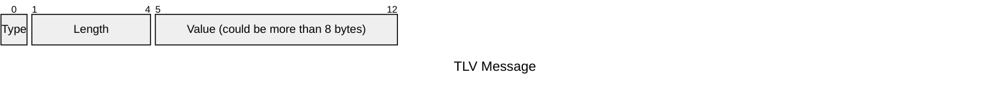

# tlv [](https://github.com/sona-tau/tlv/actions/workflows/ci.yml)

A small C23 library for serializing and deserializing typed values over sockets using the [Type-Length-Value](https://wikipedia.org/wiki/Type%E2%80%93length%E2%80%93value) wire format.
- https://wikipedia.org/wiki/Type%E2%80%93length%E2%80%93value

Each message looks like this:



Multiple frames can be concatenated into a single stream and sent in one `write()`.

## Supported types

| Type tag | C type        | Description                          |
|----------|---------------|--------------------------------------|
| `T_U08`  | `uint8_t`     | Unsigned 8-bit integer               |
| `T_U16`  | `uint16_t`    | Unsigned 16-bit integer              |
| `T_U32`  | `uint32_t`    | Unsigned 32-bit integer              |
| `T_U64`  | `uint64_t`    | Unsigned 64-bit integer              |
| `T_S08`  | `int8_t`      | Signed 8-bit integer                 |
| `T_S16`  | `int16_t`     | Signed 16-bit integer                |
| `T_S32`  | `int32_t`     | Signed 32-bit integer                |
| `T_S64`  | `int64_t`     | Signed 64-bit integer                |
| `T_F32`  | `float`       | IEEE-754 32-bit float                |
| `T_F64`  | `double`      | IEEE-754 64-bit float                |
| `T_BOL`  | `bool`        | Boolean                              |
| `T_STR`  | `String`      | UTF-8 string (not null-terminated)   |
| `T_BIN`  | `Buffer`      | Raw binary data                      |
| `T_ERR`  | `ErrString`   | UTF-8 error string                   |
| `T_TIM`  | `Timestamp`   | Unix timestamp (`int64_t`)           |
| `T_CHR`  | `Codepoint`   | Unicode codepoint (UTF-32, `uint32_t`) |

## Usage

### Sending

Steps:
1. serialize values
2. concatenate them into a stream
3. write to socket

```c
#include "tlv.h"

Buffer stream = serialize((uint32_t)file_size);
stream = buf_append(stream, serialize_cstr(filename));
stream = buf_append(stream, serialize_bin(file_data));

write(fd, stream.bytes, stream.len);
free(stream.bytes);
```

### Receiving

Steps:
1. read from socket
2. deserialize
3. access by type

```c
Buffer incoming = { .bytes = recv_buf, .len = n };
Message *msgs = deserialize(incoming);

uint32_t size     = message_u32(msgs[0]);
char    *filename = message_cstr(msgs[1]);   // heap-allocated, call free()
Buffer   data     = message_bin(msgs[2]);

// do your thing

free(filename);
for (size_t i = 0; i < da_length(msgs); i++)
	message_free(&msgs[i]);
da_free(msgs);
```

## Build

Bootstrap once:

```sh
cc nob.c -o nob
```

Then:

```sh
./nob            # build .build/libtlv.a and .build/libtlv.so
./nob test       # compile and run tests (ASan + UBSan enabled)
./nob static     # static library only
./nob dynamic    # dynamic library only
./nob docs       # generate HTML docs in .build/docs/html/index.html
./nob valgrind   # run tests under Valgrind
./nob clean      # remove .build/
```

The `nob` binary recompiles itself automatically when `nob.c` changes.

## Ownership rules

Remember this !!!

- `serialize*()` and `buf_append()` return an **owned** `Buffer`
    - call `free(buf.bytes)` when done.
- `deserialize()` returns an **owned** `Message*` array
    - call `message_free()` on each element, then `da_free()`.
- `message_cstr()` returns a **heap-allocated** `char*`
    - call `free()` when done.
